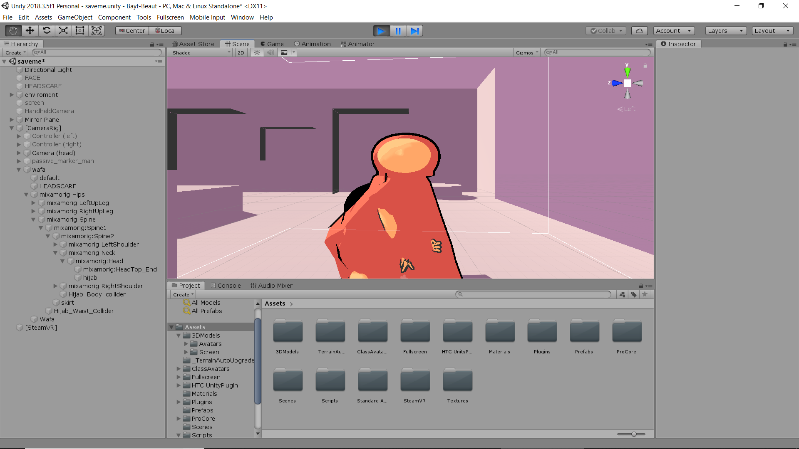

# Bayt-Beaut
VR game in progress
Created by: Hajar Azzam and Regina Wang

## About:
The concept behind the game is explore the family dynamics in Arab families and the different types of “endearing” commentaries that are given by the older members of any family to the younger generation. The game will allow the player to be immersed into an Arab character, that they will get to create physically, then live the game through it without control over its intellectual and behavioural characteristics.

## Tools needed:
This game was created in Unity and requires at least Unity 2018.3.5 to run in Unity since this game has not been deployed to any other platform. Bayt Beaut also requires an HTC Vive and also currently requires a Google Oauth key for Cloud Speech API. 

## Screenshots:
The current living room:

The player's avatar or skin, which can be seen with the mirror.

